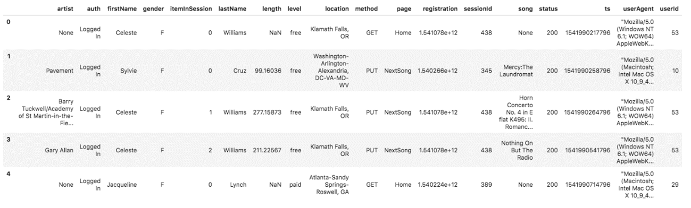

# Project: Data Warehouse

## Overview

In this project we will design a database and create and ETL process to perform the transformation and ingestion of data into tables in Redshift so as we can answer many possible questions using queries.

We will build this ETL to extract data from S3, where data of our app, Sparkify, resides. We will read these JSON logs, stage them in Redshift and transform data into fact and dimension tables. These tables will be created using a distribution strategy for a better performance of the analytics.

We will use a star schema in this database so we can run simple queries to know, for instance, what songs their users are listening to or which time of the day is the one with more traffic. The tables of this database will be the following.

- Fact table (songplay): contains all the records in event data associated with song plays, i.e. records with page NextSong.

- Dimensional tables:
    - user: users in the app
    - song: songs in the database
    - artist: artist in the database
    - time: timestamps of records in songplays broken down into specific units
    
Finally, after loading data in this tables, we can propose some simple queries that the analysts could run to get some relevant information of the app and the behavior of its users.

## Datasets

The required data of this app, Sparkify, are stored in S3. We have access to a collection of JSON files, divided in two different parts.

- Song data: `s3://udacity-dend/song_data`
- Log data: `s3://udacity-dend/log_data`

### Song data

The information contained in this JSON files is related to a song and its artist. It is a subset of real data from [Million Song Dataset](http://millionsongdataset.com/) and the files we have access to are partitioned by the first three letters of each song's track ID.

The fields of this dataset are the following:
`num_songs, artist_id, artist_latitude, artist_longitude, artist_location, artist_name, song_id, title, duration, year`

### Log data

These JSON files are generated using this [event simulator](https://github.com/Interana/eventsim) based on the songs in the dataset above. The app activity is simulated, so we can get information of it, joined with the songs and artists data seen previously.

The fields of this dataset are the following:
`artist, auth, firstName, gender, itemInSession, lastName, length, level, location, method, page, registration, sessionId, song, status, ts, userAgent, userId`

Here we include an example of how this dataset looks like.

We will be interested in the events associated with song plays, which are identified with the field page 'NextSong'.

For these data to be imported successfully in AWS we need a third file, which is `s3://udacity-dend/log_json_path.json`. As before, we include an image of what data is included in this file.

## Schema for song analysis

As mentioned before, we have selected a star schema for this database. It is more efficient than a 3NF database for analytical purposes, since no inefficient and computationally expensive joins are necessary to query the tables. Here, our fact table contains all the records in the events dataset associated with song plays. Apart from that, we will create four more dimensional tables: user, song, artist and time. Below, an image of this star schema can be checked to see all the fields of each table.

This schema will be optimized for queries on song play analysis. In order to reach this aim, we will set the DISTSTYLE to ALL in the user, song and time tables. Using this strategy, a copy of the entire tables is distributed to every node. This distribution strategy should only be used for tables that are not updated frequently because load, update, or insert data operations are slow.

## AWS Redshift

The staging tables will be created in Redshift. In order to set the cluster and create a database we follow the instructions seen along this lesson. Since S3 buckets where data for the project reside in the region `us-west-2`, our database is also created here.

Our cluster is named `sparkify-cluster` and we choose the `Free Trial` option, so our computing power is `2 vCPU (gen 2) / node x 1 = 2 vCPU`. Apart from that, we also create a database, called `sparkifydb`, whose user, password and other required data are stored in the `dwh.cfg` file.

## Analysis Queries

Once data are transformed and loaded into the final tables, we are ready to start the analysis. We are interested first in the gender distribution of the users. In order to check that, the following query can be run.

`SELECT
    u.gender,
    COUNT(*)
FROM user u
GROUP BY u.gender;
`

For instance, we could also query the database to know how many songplays occurred in a given month. It could be interesting to know the name of the artists and the songs played.

`
SELECT
    a.name,
    s.title,
    s.year,
    s.duration
    t.start_time
FROM songplay sp
JOIN artist a ON(sp.artist_id = a.artist_id)
JOIN song s ON(sp.song_id = s.song_id)
JOIN time t ON(sp.start_time = t.start_time)
WHERE t.year = 2020
    AND t.month = 3
ORDER BY t.start_time;
`

Finally, we could try to try to find out who is the most active user of our app.

`SELECT
    u.first_name,
    u.last_name,
    u.gender,
    u.level
FROM user u
JOIN (
    SELECT
        sp.user_id,
        COUNT(*) AS total_count
    FROM songplay sp
    GROUP BY sp.user_id
    ORDER BY COUNT(*) DESC
    LIMIT 1
) sp_aux
    ON u.user_id = sp_aux.user_id
`